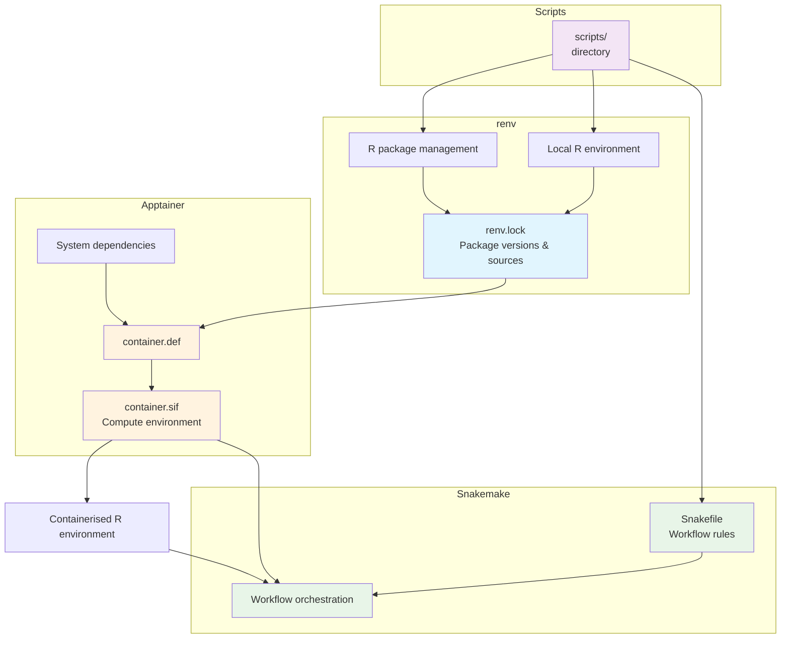

# Snakemake R Workflow with Apptainer and renv

<p align="center">
     <a href="https://github.com/atsyplenkov/snakemake_apptainer_renv/.github/workflows/ci.yml"></a>
     <a href="https://opensource.org/licenses/MIT"></a>
     <a href="https://github.com/atsyplenkov/snakemake_apptainer_renv/generate">
         
     </a>
</p>

## How it works
This project shows how to use Snakemake to automate an R workflow inside a reproducible Singularity/Apptainer container. It builds a container image from a definition file `container.def`, installing R packages listed in the `renv.lock` and all system dependencies. Then `snakemake` runs your scripts inside the created container (`container.sif`) in order defined in the `Snakefile`. Such approach makes sure that the computational environment is reproducible and reusable. As an extra bonus, it comes with the continuous integration that runs the workflow on every push to the `master` branch.



## Directory structure
The `Snakefile` is the backbone of the workflow. It defines the order of the steps and the dependencies between them. In the current implementation it uses the built-in [R integration of Snakemake](https://snakemake.readthedocs.io/en/stable/snakefiles/rules.html#r-and-r-markdown). That is, user can specify variables in the `Snakefile` and use them in the R scripts via `snakemake@input` and `snakemake@output` objects (see `scripts/test_script.R` for an example).

```text
.
├── container.def   # Singularity definition file
├── container.sif   # Singularity image file
├── in              # Input directory
│   └── mtcars.csv
├── out             # Output directory
│   ├── cyl.csv
│   └── paths.txt
├── renv            # renv directory
│   ├── activate.R
│   ├── library
│   ├── settings.json
│   └── staging
├── renv.lock       # renv lock file
├── scripts         # Scripts directory
│   └── test_script.R
└── Snakefile       # Snakemake workflow file

```

## Plain language summary & reasoning
Imagine you are doing your R&D work and until the end of the project, you do not know for sure what kind of R packages will be needed. The SOTA approach in such cases is to use `renv` to manage your R packages. This library helps to track the R packages you use and records them in the `renv.lock` file. That is, code is written, money is made. And now you are at the end of the project and happy to archive it and move forward. But after two years your boss says, "We need to reproduce the results." What do you do?

Luckily, `renv` recorded all the R packages and the R version. However, it did not record the system dependencies. What usually happens to me is that I need a specific GDAL version with specific drivers installed (hello, KEA lib), but I do not always record them. Therefore, even if I restore `renv` on a new machine, I'll probably fail to reproduce the results. 

One way to tackle this is to create a container image with all the R packages and system dependencies you need, and then run your code inside that container. This is where `Apptainer` comes to the rescue. Similar to Docker and Podman, it creates `.sif` images from `.def` specification files. By bootstrapping container building by pulling images from Docker Hub, R packages recorded by `renv` can be easily restored and your favourite system dependencies can be manually installed or even built from source.

However, another thing we need to keep in mind in R&D jobs is the order of the steps. Especially in large projects with many inputs, it is not always easy to understand which script to run first. And, mostly, do we need to run all scripts if we change only one input file? For such cases people invented `snakemake`. It allows you to define the order of the steps and run them in a reproducible way, executing only the scripts that need to be re-run.

This repository serves as a template for such projects. The idea is that you start working within `renv`, and create scripts in the `scripts/` directory. Any unusual system dependencies should be specified in the `container.def` file. The order of the steps should be manually recorded in the `Snakefile`. Then, as soon as you finish writing the code, you can run the workflow with the following command:

```shell
# N is the number of parallel jobs you want to run simultaneously
snakemake --use-singularity --cores N
```

This will build the container image from the `container.def` file and run the scripts within the container in the order defined in the `Snakefile`. If it finishes successfully, you can be assured that the results are reproducible and you can rerun them on a new machine in future.


## How to use the template
1. Clone the repository or create new from [a template](https://github.com/atsyplenkov/snakemake_apptainer_renv/generate):
```shell
git clone https://github.com/atsyplenkov/snakemake_apptainer_renv.git
cd snakemake_apptainer_renv
```

2. Install `miniforge3` and `apptainer` using default params as described in their docs. Then install `snakemake`. Any `snakemake` version will do, but the current template has been tested under `9.10.0`:
```shell
conda create -c conda-forge -c bioconda -n snakemake snakemake=9.10.0
```

3. Activate `snakemake` by running:
```shell
conda activate snakemake
```

4. Run the workflow with the following command:
```shell
snakemake --use-singularity --cores 1
```
If you want to run workflow in parallel, you can use the following command:
```shell
snakemake --use-singularity --cores 2
```
It will make `snakemake` to run jobs `run_test_script` and `run_test_script2` simultaneously.

# See also
- [A bit more complex implementation](https://github.com/bast/contain-R) of similar approach connecting `renv` and `snakemake` with Singularity by [**@bast**](https://github.com/bast)
- [Testing Snakemake template](https://ginolhac.github.io/posts/2023-09-07_snakemake-test-ci/index.html)
- [Pat Schloss's project](https://github.com/riffomonas/drought_index/tree/main) on running R workflows with `snakemake` (within `conda`)
- [Snakemake documentation](https://snakemake.readthedocs.io/en/stable/)
- [Singularity documentation](https://apptainer.org/docs/)
